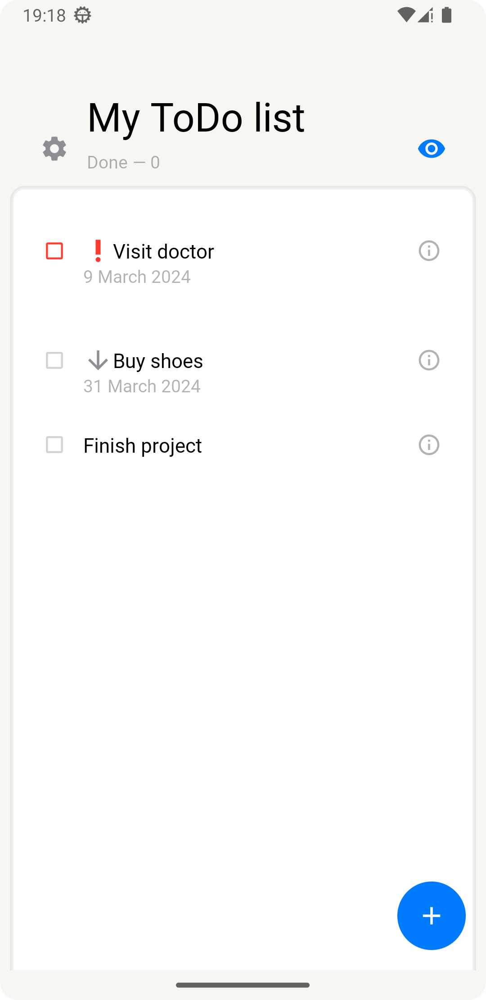
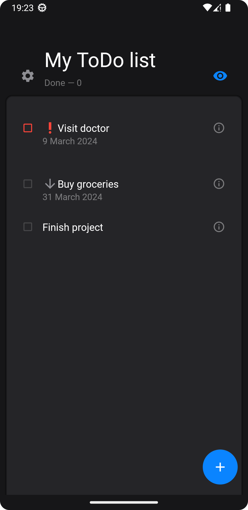
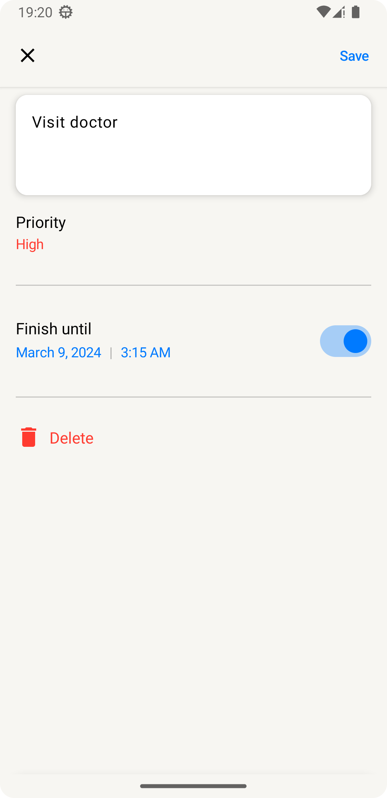
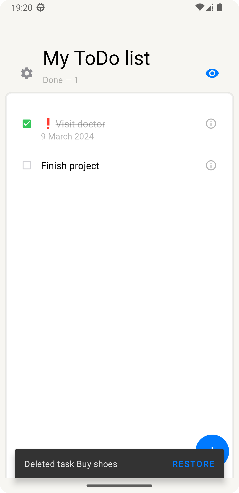
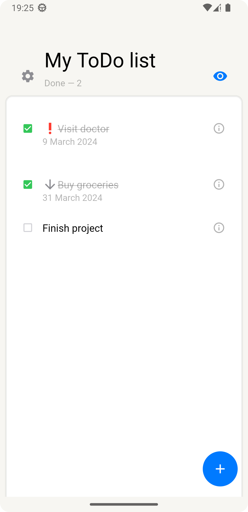
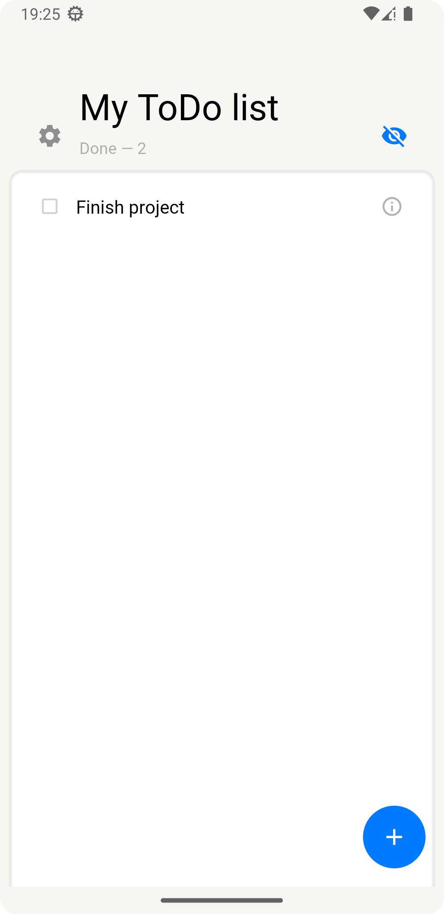

# Todo-App
В проекте были применены следующие базовые знания по Android разработке:

1. Многопоточность;
2. Внедрение зависимостей (Dagger);
3. Работа с сетью (Retrofit);
4. Работа с базами данных (Room);
5. Экран для изменения задачи сначала был написан на XML и в дальнейшем переписан на JetpackCompose;
6. Анимации простые;

---
Вид приложения:

---
Экран изменения задачи:

---
Возможность отмечать задачи как выполненные. Восстановление недавно удаленных задач.

---
Возможность скрывать выполненные задачи:

